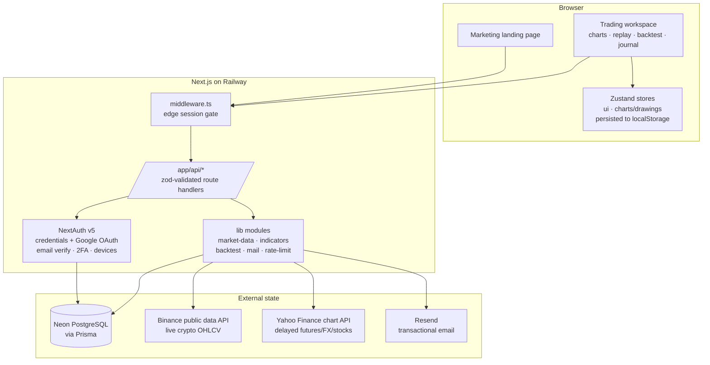

# ConfluentX — Architecture

> Audited & documented July 8, 2026. This is the reference for how the system
> is actually built — read it before proposing structural changes.

## System overview

ConfluentX is a **single Next.js 15 (App Router) application** — one deployable
unit that contains the marketing site, the authenticated trading workspace,
and all backend API routes. There is deliberately **no separate backend
service**: at current scale (two users, no real-time streaming), service
boundaries live at the *module* level, not the network level.

## Module boundaries (the "services")

| Module | Path | Responsibility |
| --- | --- | --- |
| **Auth** | `src/auth.ts`, `src/auth.config.ts`, `src/middleware.ts`, `src/app/api/auth/*` | NextAuth v5. Credentials (bcrypt) + Google OAuth, email verification gate, email 2FA (`TwoFactorConfirmation` handshake), device-session auditing, JWT sessions. Middleware does optimistic cookie checks at the edge; real verification happens in `requireSession()` per handler. |
| **Market data** | `src/lib/market-data/` | The system's most important boundary. `types.ts` defines `MarketDataProvider` + `Candle/Quote/SymbolMeta`. Routing in `index.ts`: crypto → `live-crypto.ts` (Binance, keyless, real down to 1s), futures/FX/stocks → `live-yahoo.ts` (real, ~15 min delayed, 1m floor), anything else or any feed error → `mock-provider.ts` (deterministic seeded generator). `resample.ts` aggregates fine bars into any timeframe. Consumers use async `getCandlesAsync`/`getQuotesAsync` and never see provider details. |
| **Indicator engine** | `src/lib/indicators/` | 14 pure-function indicators (EMA/SMA/WMA/HMA/VWAP/BB/Keltner/Ichimoku overlays; RSI/MACD/Stoch/CCI/ADX/ATR oscillators) behind a registry. Charts render unlimited instances; adding an indicator = adding one `IndicatorDef`. |
| **Backtest engine** | `src/lib/backtest/` | `engine.ts`: signal builders (EMA cross, RSI reversal, breakout) + conservative fill simulation (next-bar-open entries, stop-before-target, slippage, trailing stops, risk-% sizing) + metrics. `monte-carlo.ts`: bootstrap resampling. Pure functions — run client-side today, portable to a worker/server unchanged. |
| **Chart terminal** | `src/components/dashboard/trading-chart.tsx`, `src/store/charts.ts` | lightweight-charts v4 wrapper: indicator manager, synced oscillator pane (whitespace-padded timeline), canvas overlay engine (drawings, volume profile, killzones), settings (style/colors/grid/legend/countdown/watermark/timezone). Drawings persist per symbol in the `cx-charts` Zustand store (localStorage). |
| **Replay simulator** | `src/components/dashboard/replay-workspace.tsx` | Stateful playback (play/pause/speed/step/scrub/hotkeys) over a static historical slice; manual orders with SL/TP price lines, risk-% sizing, intrabar stop/target fills; session metrics; closed trades POST to the journal. |
| **API layer** | `src/app/api/*` | Thin zod-validated handlers: `chart`, `journal`, `watchlist(+quotes)`, `alerts`, `settings`, `account`, `dashboard`, `user`, `subscription`, `health`. Conventions: `requireSession()` guard, `isSameOrigin()` CSRF check on mutations, `apiError/apiSuccess` envelopes, per-route rate limits where abuse is possible. |
| **Persistence** | `prisma/schema.prisma`, `src/lib/db.ts` | Neon Postgres. Models: User/Account/tokens (auth), DeviceSession, WatchlistItem, Alert, JournalEntry, UserSettings, Subscription. Schema synced with `prisma db push` (no migration history yet — see debt). |
| **Email** | `src/lib/mail.ts`, `src/emails/` | React Email templates via Resend; without `RESEND_API_KEY` all mail logs to the server console (dev fallback — currently also true in prod, see debt). |
| **Marketing** | `src/app/(marketing)/` | Public landing page (R3F hero, scroll sections). Served at `/` to logged-out visitors; signed-in users are redirected to `/dashboard` by middleware. |

## Cross-cutting decisions

- **Environment**: all config via env vars (`DATABASE_URL`, `AUTH_SECRET`,
  `AUTH_URL`, `AUTH_GOOGLE_*`, `RESEND_API_KEY`, `MAIL_FROM`,
  `NEXT_PUBLIC_APP_URL`, optional `BINANCE_DATA_API`). Railway is the source
  of truth for prod values; `.env` (gitignored) for local. **`AUTH_URL` is
  mandatory on Railway** — its proxy hides the public host and OAuth
  redirect URIs degrade to `localhost:8080` without it.
- **Validation**: zod at every API boundary; shared schemas in `src/lib/validators/`.
- **Error handling**: handlers return typed JSON envelopes; feed failures
  degrade to mock data rather than erroring; mail failures never block auth
  flows. Logging is `console.*` captured by Railway (no aggregation yet).
- **State**: server state lives in Postgres; UI state in two small Zustand
  stores; market data is fetched per view (30s poll on charts) — no client cache
  layer until real-time streaming exists.
- **Deployment**: Railway auto-builds `main` via Nixpacks (`prisma generate &&
  next build`); custom domain `confluentx.capital`; Vercel backup deployment
  from the same repo; same Neon DB everywhere.

## Technical debt (honest register)

1. **Zero automated tests.** The pure engines (indicators, backtest,
   resampler) are cheap to test and currently untested. Highest-value gap.
2. **No CI gate.** Railway deploys whatever lands on `main`; typecheck runs
   only on dev machines.
3. **Prod email is console-only.** Without `RESEND_API_KEY`, email/password
   signups on production can never receive their verification link (Google
   OAuth users are unaffected). Needs a key + verified domain.
4. **Google OAuth app is in testing mode** — capped at 100 allow-listed users.
5. **Yahoo feed is unofficial + delayed.** Fine for the private simulator;
   a licensed provider (Databento/Polygon) is required before charging users.
   No sub-minute futures bars (those fall back to mock, flagged `live:false`).
6. **No real-time streaming** — charts poll; no WebSocket layer.
7. **Dashboard overview numbers are still mock** (`src/lib/mock/dashboard.ts`):
   balance/positions/recent-trades are decorative; only Journal/Replay data is real.
8. **Workspace state is per-browser** (localStorage) — layouts/drawings don't
   follow the user across devices.
9. **In-memory rate limiting** — resets each deploy, per-instance only; swap
   to Upstash if horizontal scaling ever happens.
10. **`prisma db push` instead of migrations** — no schema history/rollback.
11. **No error tracking / structured logging** (Sentry or similar).
12. **`/api/health` is unauthenticated** (exposes DB-up/down only; low risk, by design for uptime checks).
13. **Repo lives inside OneDrive** on the dev machine — sync contention risk with `node_modules`.
14. **lightweight-charts pinned to v4** — v5's native panes would simplify the oscillator pane, but is a breaking migration.

## Phase 2 roadmap (prioritized)

**P0 — make production honest (days)**
1. Resend API key + verify `confluentx.capital` → real verification/2FA email.
2. Publish the Google OAuth consent screen (remove test-user cap).
3. GitHub Actions CI: typecheck + build on every push; block bad deploys.
4. Adopt `prisma migrate` before the next schema change.

**P1 — trust & continuity (1–2 weeks)**
5. Unit tests for `lib/indicators`, `lib/backtest`, `lib/market-data/resample` (pure functions, no mocking needed).
6. Sentry (or equivalent) error tracking on client + server.
7. Persist workspace (layouts/drawings/indicator sets) to `UserSettings` for cross-device sync.
8. Derive dashboard overview stats from real journal data; delete `lib/mock/dashboard.ts`.

**P2 — the product bet (when ready to spend)**
9. Licensed market data (Databento) behind the existing provider interface; then a WebSocket streaming gateway and true real-time bars.
10. Replay upgrades: limit orders, draggable SL/TP lines, spread modeling (needs tick data from #9).
11. Bulk backtest optimizer (parameter sweeps) — *this* is when a Web Worker earns its complexity, not before.

---

*Rule of thumb encoded here: boundaries are modules until scale demands
services; data providers hide behind one interface; engines stay pure so they
can move (client → worker → server) without rewrites.*
